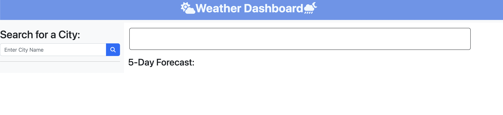

# Weather-Dashboard

## Description

Build a weather dashboard that will run in the browser for users to be able to see the weather outlook for multiple cities.

- User is presented with form inputs to search for a city

- Then the user is presented with current and future conditions for that city and the city is added to the search history

- When user is viewing current weather conditions, the user is presented with city name, date, temperature, the humidity, the wind speed, the UV index, and an icon representation of weather conditions

- When viewing the UV index, the user is presented with a color that indicates whether the conditions are favorable, moderate, or severe

- When viewing future weather conditions for that city, the user is presented with a 5-day forecast that displays the date, an icon representation of weather conditions, the temperature, the wind speed, and the humidity

- When the user clicks on a city in the search history, the user is prsented with current and future conditions for that city 

## Usage

User can find deployed app at [GitHub](https://github.com/Babylex710/Weather-Dashboard)

The following image shows the web application's appearance:

